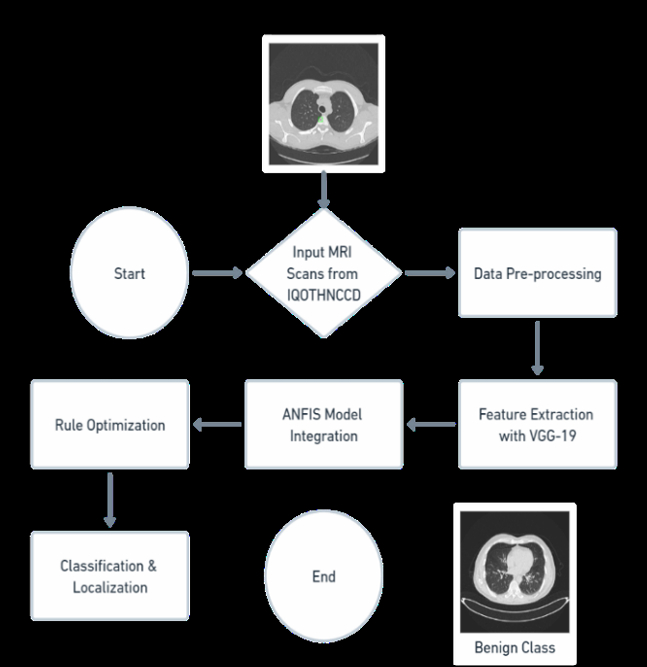

# Enhancing Lung Cancer Detection and Localization with VGG-19 and ANFIS

## Project Overview

This project presents a novel hybrid approach to lung cancer diagnosis that combines the deep learning capabilities of VGG-19 with the interpretability of the Adaptive Neuro-Fuzzy Inference System (ANFIS). The goal is to improve not only the accuracy but also the explainability of automated lung cancer detection and localization, using imaging data such as CT scans and X-rays.

Despite recent advances in diagnostic imaging, early-stage lung cancer often goes undetected due to the subtlety of patterns and limitations in conventional machine learning methods. By fusing deep convolutional networks with fuzzy logic reasoning, this model attempts to bridge that gap—allowing for both high-precision classification and localized interpretation of potentially malignant regions.

The framework has been trained and validated using the IQ-OTH/NCCD dataset, with promising results in distinguishing normal, benign, and malignant tissue classes. This work was presented at the 2024 Systems and Information Engineering Design Symposium (SIEDS), underscoring its contribution to the intersection of AI and clinical diagnostics.

## Methodology

At the core of the system lies the VGG-19 convolutional neural network, a model pre-trained on large-scale image datasets and fine-tuned here for the task of lung cancer detection. VGG-19 is responsible for extracting high-dimensional feature vectors from the input images, capturing subtle differences in tissue density, edge gradients, and textural abnormalities that are often early signs of cancer.

These features are then passed into an ANFIS model, which translates them into fuzzy linguistic terms like “low,” “medium,” or “high” based on their intensity and spatial variation. Using a learned set of fuzzy if-then rules, ANFIS infers the likelihood of malignancy, adjusting its rule base iteratively using neuro-adaptive learning.

To ensure compatibility between the two components, feature vectors undergo normalization and dimensionality reduction using PCA before entering the fuzzification stage. The ANFIS layer is configured to optimize membership functions and rule weights throughout training, ensuring reliable and interpretable decisions.

The combined system not only classifies lung images but also pinpoints the regions most indicative of cancer, helping clinicians better understand model predictions and prioritize follow-up actions.



## Experimental Results

The hybrid model was evaluated on unseen data from the IQ-OTH/NCCD dataset and demonstrated high diagnostic performance across multiple classes. Malignant cases were identified with 90% precision and 91% recall, yielding an F1 score of 90.5%. Benign cases saw slightly lower, but still strong, scores of 89% precision and 88% recall. Normal lung tissue was classified with 94% precision and 95% recall.

The learning curves showed consistent improvements across training epochs, with minimal gaps between training and validation accuracy—suggesting effective generalization and low risk of overfitting. The architecture also showed efficiency in training convergence, aided by the interpretability and adaptive tuning of the ANFIS layer.

These results reflect not only accurate classification but also the model’s capacity to adapt to real clinical data, with a meaningful blend of computational strength and medical logic.

## Conclusion

The integration of VGG-19 and ANFIS in this project represents a significant advancement in AI-driven medical diagnostics. While VGG-19 offers powerful deep learning feature extraction, ANFIS contributes interpretability and adaptive decision-making. Together, they form a diagnostic tool capable of detecting, predicting, and localizing lung cancer with high reliability.

This model opens the door for real-world clinical applications, especially where both accuracy and transparency are crucial. Future work will involve adapting the system to other types of cancer, scaling to larger datasets, and embedding the model within clinical support tools for radiologists and oncologists.

## Citation

If you reference or use this work, please cite:

```bibtex
@inproceedings{kumar2024lung,
  title     = {Enhancing Lung Cancer Detection and Localization with a Hybrid VGG-19 and Adaptive Neuro-Fuzzy Inference System (ANFIS) Approach on Imaging Data},
  author    = {K. Nithish Kumar and Sai Santhosh V C and Aniket Mane and Rahimunnisa K and G. Nirmal and Maitreya Vaghulade},
  booktitle = {2024 Systems and Information Engineering Design Symposium (SIEDS)},
  year      = {2024},
  publisher = {IEEE},
  doi       = {10.1109/SIEDS61124.2024.10534680}
}
```

## Contact

For any queries, collaboration opportunities, or further information about this project, feel free to reach out:

**Maitreya Vaghulade**  
📧 [maitreya.vaghulade@gmail.com](mailto:maitreya.vaghulade@gmail.com) 
